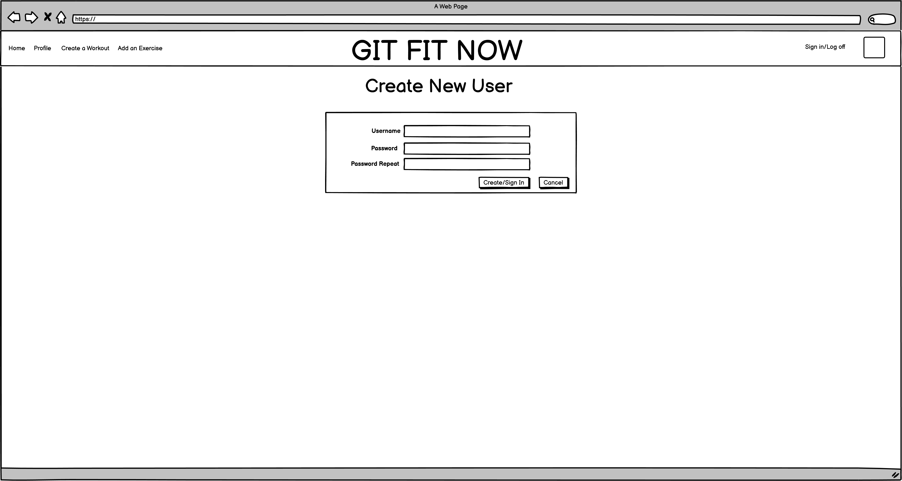

# django_project_app

<!-- Table of Contents -->

    
Table of Contents

    <ol>
        <li><a href = "#application-name">Application Name</a></li>
        <li><a href = "#concept">Concept</a></li>
        <li><a href = "#user-stories">User Stories</a></li>
        <li><a href = "#entity-relationship-diagram">Entity Relationship Diagram</a></li>
        <li><a href = "#wireframes">Wireframes</a></li>
        <li><a href = "#technologies-used">Technologies Used</a></li>
        <li><a href = "#additional-information">Additional Information</a></li>
        <li><a href = "#app-demo">App Demo</a></li>
    </ol>

## Application Name: 
GIT FIT NOW

## Concept:
This app was created to encourage everyone to live a better lifestyle and get more into exercising. Users can create, share and look up workouts based on intensity and the body part they are looking to workout. 

## User Stories
I want the user to be able to sign in under a username and password. 
I want the user to be able to create an account to the workout app.  
I want the user to be able to add a type of exercise if it is not in the database. 
I want the user to create different workouts and save them. 
I want the user to be able to see all their saved workouts on their profile page 
I want the user to look up other workouts based on intensity and body part. 
I want the user to be able to use a search function.  

Extra:  
I want the user to be able to search by intensity or body part  
I want the user to generate multiple rounds with different exercises.  
I want the user to be able to generate a new workout based on intensity and body part.

## Entity Relationship Diagram:

## Wireframes:

## Technologies Used:
* [Django](http://djangoproject.com)
Python
HTML
PostgreSQL

## Additional information:
Developed by Dominick
Linkedin: https://www.linkedin.com/in/dominick-chiang-e-i-t-30751182/

## App Demo
https://workout-app-dom2.herokuapp.com/
https://github.com/chiangd233/django_project_app/*
