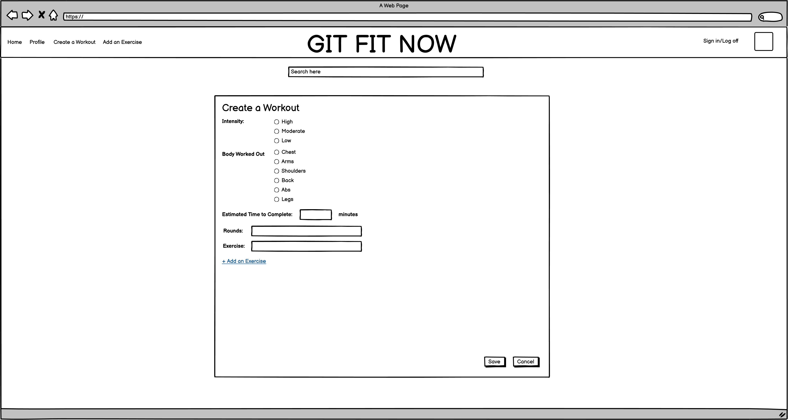

# django_project_app

# Application Name: 
GIT FIT NOW

## Concept:
This app was created to encourage everyone to live a better lifestyle and get more into exercising. Users can create, share and look up workouts based on intensity and the body part they are looking to workout. 

## User Stories
I want the user to be able to sign in under a username and password. 
I want the user to be able to add a type of workout. 
I want the user to create different workouts and save them. 
I want the user to look up other workouts based on intensity and body part. 
I want the user to be able to use a search function.  

Extra:  
I want the user to generate multiple rounds with different exercises.  
I want the user to be able to generate a new workout based on intensity and body part.

## Entity Relationship Diagram:

## Wireframes:

## Technologies Used:
Django
Python
HTML
PostgreSQL

## Approach:

## Challenges:

## Additional information:
Developed by Dominick

## App Demo
https://github.com/chiangd233/django_project_app/
